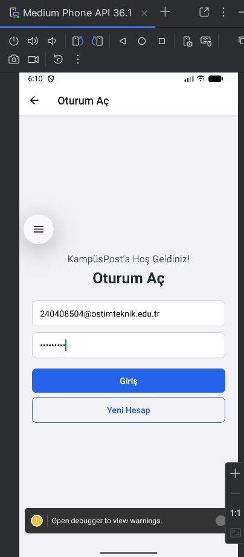
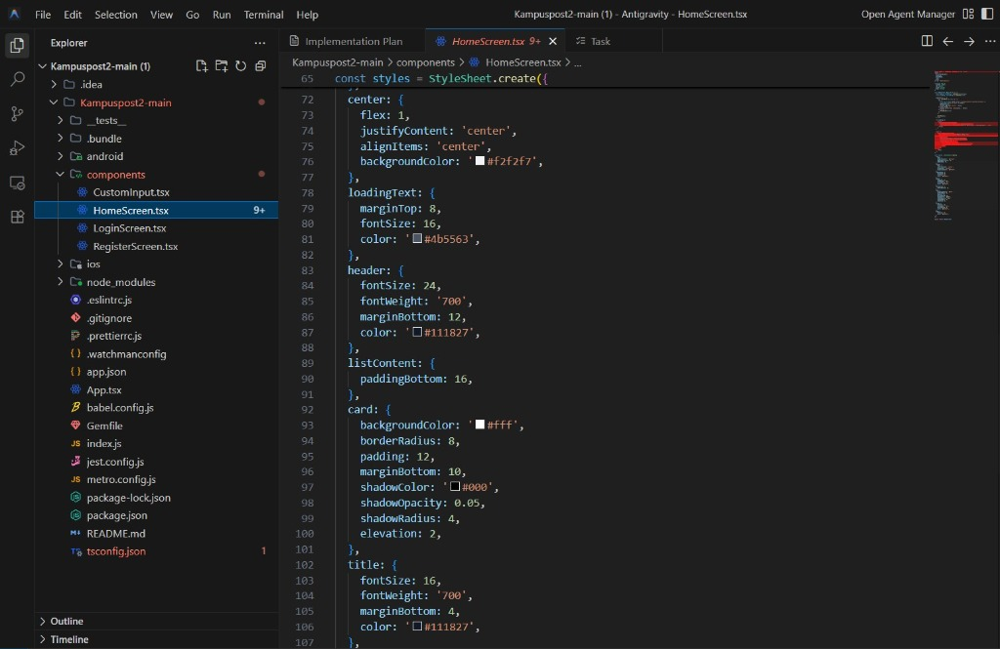
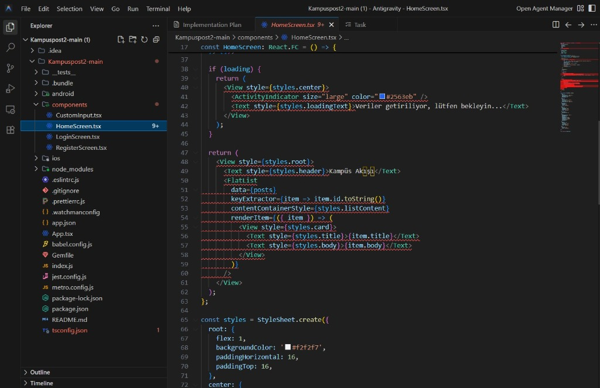
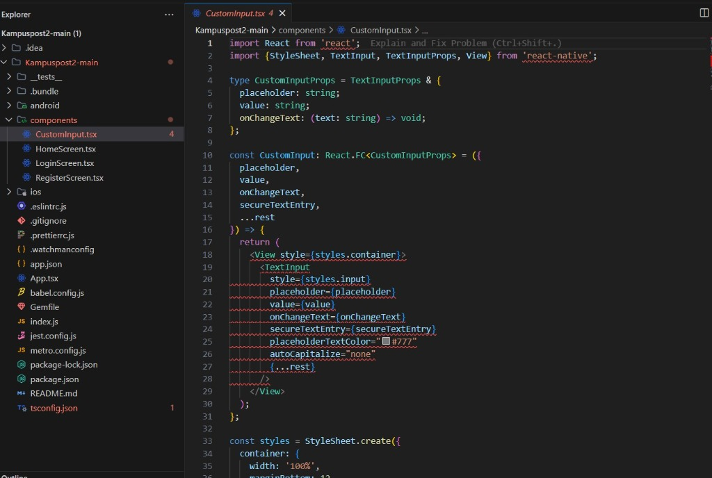
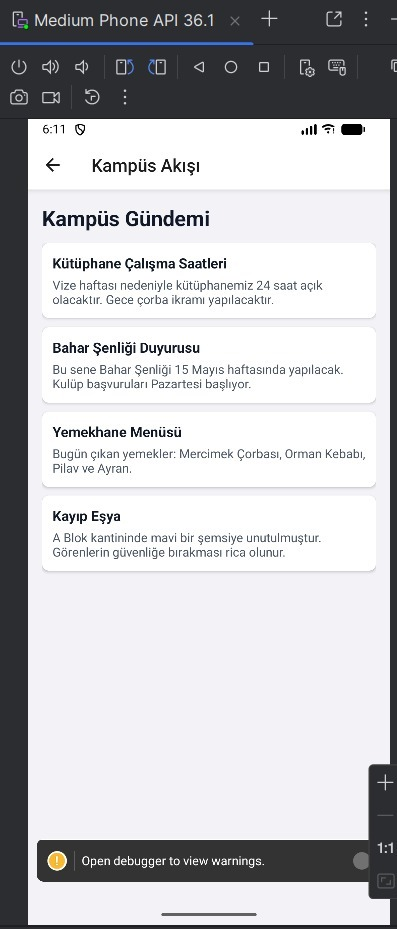

## Kampüs Sosyal – React Native Projesi
## Kopyalamayınız
Görseller:







Bu proje, React Native kullanılarak geliştirilmiş basit bir **Kampüs Sosyal** uygulaması iskeletidir.  
Ödev kapsamında şu özellikler uygulanmıştır:

- **Giriş ekranı (`LoginScreen`)** – E‑posta, şifre alanları ve “Giriş Yap / Kayıt Ol” butonları
- **Kayıt ekranı (`RegisterScreen`)** – E‑posta, şifre, şifre tekrar alanları ve şifre doğrulama
- **Ana ekran (`HomeScreen`)** – Uzak API’den post verisi çekme ve listeleme
- **React Navigation** ile **Stack Navigator** yapısı
- **Yeniden kullanılabilir `CustomInput` bileşeni**

## Projeyi Çalıştırma

Terminalde proje klasörüne girin:

```sh
cd KampusPost2-main
```

Metro (React Native dev server) başlatın:

```sh
npm start
```

Yeni bir terminal penceresinde Android emülatörü veya cihaz üzerinde uygulamayı çalıştırın:

```sh
npm run android
```

> iOS için ek kurulumlar (macOS, Xcode, CocoaPods) gerektiğinden bu projede ana odak Android tarafıdır.

## Ekranlar ve Navigasyon

- **NavigationContainer + Stack Navigator**  
  `App.tsx` içinde `NavigationContainer` ve `createNativeStackNavigator` ile şu ekranlar tanımlıdır:
  - `Login` → `LoginScreen`
  - `Register` → `RegisterScreen`
  - `Home` → `HomeScreen`  
  Açılış ekranı **LoginScreen**’dir (`initialRouteName="Login"`).

- **LoginScreen**  
  - Üst yazı: **“Kampüs Sosyal'e Hoş Geldin!”**  
  - Başlık: **“Hesabına Gir”**  
  - Alanlar: E‑posta, Şifre (`CustomInput` bileşeni ile)  
  - Butonlar:
    - **“Giriş Yap”** → şimdilik doğrulama yapmadan **HomeScreen**’e yönlendirir.
    - **“Kayıt Ol”** → **RegisterScreen**’e yönlendirir.

- **RegisterScreen**  
  - Alanlar: E‑posta, Şifre, Şifre Tekrar (tamamı `CustomInput` kullanır).  
  - **“Hesap Oluştur”** butonu:
    - Şifreler uyuşmazsa: `Alert.alert("Dikkat", "Girdiğiniz parolalar eşleşmiyor, lütfen kontrol ediniz.")`
    - Şifreler aynıysa:
      - `console.log("Kayıt işlemi tamamlandı", { email })`
      - `Alert.alert("Kayıt Tamamlandı", "Hesabınız oluşturuldu. Şimdi giriş yapabilirsiniz.")`
      - Ardından **LoginScreen**’e geri yönlendirir.

- **HomeScreen**  
  - `useEffect` ile `https://jsonplaceholder.typicode.com/posts` adresinden veri çeker.  
  - Gelen veriyi `Post[]` tipinde state’e kaydeder ve konsola `Akış verisi:` olarak yazdırır.  
  - `FlatList` ile her post için:
    - Başlık (`title`) → kalın/büyük
    - İçerik (`body`) → altında normal metin şeklinde gösterilir.  
  - Veri yüklenirken:
    - Ortada spinner ve **“Veriler getiriliyor, lütfen bekleyin...”** metni görünür.

## Proje Klasör Yapısı

```
KampusPost/
├── App.tsx                    # Ana uygulama dosyası (NavigationContainer + Stack Navigator)
├── index.js                   # React Native giriş noktası
├── app.json                   # Expo/React Native yapılandırma dosyası
├── package.json               # NPM bağımlılıkları ve scriptler
├── package-lock.json          # NPM kilit dosyası
├── tsconfig.json              # TypeScript yapılandırması
├── babel.config.js            # Babel yapılandırması
├── metro.config.js            # Metro bundler yapılandırması
├── jest.config.js             # Jest test yapılandırması
├── Gemfile                    # Ruby bağımlılıkları (iOS için)
├── .gitignore                 # Git ignore kuralları
├── README.md                  # Proje dokümantasyonu
│
├── components/                # React Native bileşenleri
│   ├── CustomInput.tsx        # Yeniden kullanılabilir input bileşeni
│   ├── LoginScreen.tsx        # Giriş ekranı (form + butonlar)
│   ├── RegisterScreen.tsx     # Kayıt ekranı (şifre kontrolü + yönlendirme)
│   └── HomeScreen.tsx         # Ana ekran (API'den post verisi çekme + FlatList)
│
├── __tests__/                 # Test dosyaları
│   └── App.test.tsx           # App bileşeni testleri
│
├── android/                   # Android platform dosyaları
│   ├── app/
│   │   ├── build.gradle       # Android uygulama build yapılandırması
│   │   ├── proguard-rules.pro # ProGuard kuralları
│   │   └── src/
│   │       └── main/
│   │           ├── AndroidManifest.xml  # Android manifest dosyası
│   │           ├── java/               # Kotlin/Java kaynak dosyaları
│   │           └── res/                # Android kaynakları (resimler, layoutlar)
│   ├── build.gradle           # Android proje build yapılandırması
│   ├── settings.gradle        # Gradle ayarları
│   ├── gradle.properties      # Gradle özellikleri
│   └── gradle/
│       └── wrapper/           # Gradle wrapper dosyaları
│           ├── gradle-wrapper.jar
│           └── gradle-wrapper.properties
│
└── ios/                       # iOS platform dosyaları
    ├── KampusPost/
    │   ├── AppDelegate.swift  # iOS uygulama delegate
    │   ├── Info.plist         # iOS bilgi dosyası
    │   ├── LaunchScreen.storyboard  # Başlangıç ekranı
    │   ├── PrivacyInfo.xcprivacy   # Gizlilik bilgileri
    │   └── Images.xcassets/   # iOS görselleri
    │       └── AppIcon.appiconset/
    ├── KampusPost.xcodeproj/  # Xcode proje dosyası
    │   ├── project.pbxproj
    │   └── xcshareddata/
    │       └── xcschemes/
    │           └── KampusPost.xcscheme
    └── Podfile                # CocoaPods bağımlılıkları
```

### Önemli Dosyalar

- **App.tsx** – `NavigationContainer` + `Stack.Navigator` yapılandırması
- **components/** – Tüm ekran ve bileşenler
  - `LoginScreen.tsx` – Giriş ekranı (form + butonlar)
  - `RegisterScreen.tsx` – Kayıt ekranı (şifre kontrolü + yönlendirme)
  - `HomeScreen.tsx` – Post listesini gösteren ekran (API + FlatList)
  - `CustomInput.tsx` – Ortak giriş bileşeni

## Teslim İçin Önerilen Ekran Görüntüleri

- **Proje klasör yapısı**  
  `KampusPost` klasörünün içini (özellikle `App.tsx` ve `components/` klasörünü) gösteren ekran görüntüsü.

- **Navigasyon yapısı**  
  `App.tsx` içindeki `NavigationContainer` + `Stack.Navigator` kodunun ekran görüntüsü.

- **Giriş ekranı**  
  `Kampüs Sosyal'e Hoş Geldin!` üst yazısı, `Hesabına Gir` başlığı, e‑posta / şifre alanları ve  
  **“Giriş Yap” / “Kayıt Ol”** butonlarının göründüğü ekran.

- **Kayıt ekranı**  
  E‑posta, Şifre, Şifre Tekrar alanları ve **“Hesap Oluştur”** butonunun göründüğü ekran.  
  Şifreler uyuşmadığında çıkan **Alert** penceresinin ekran görüntüsü.  
  Şifreler uyduğunda konsolda görünen **“Kayıt işlemi tamamlandı”** logunun ekran görüntüsü.

- **HomeScreen ve veri çekme**  
  - `Akış verisi:` log’unun göründüğü **DevTools Console** veya terminal ekranı.  
  - `FlatList` ile post’ların listelendiği HomeScreen ekran görüntüsü.  
  - Varsa **“Veriler getiriliyor, lütfen bekleyin...”** metninin göründüğü anın ekran görüntüsü.


